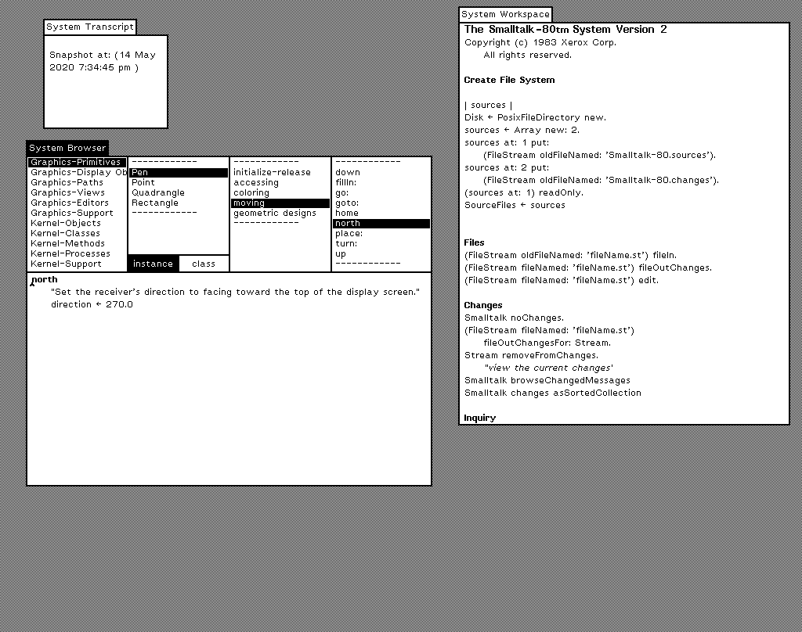

# Smalltalk-80

Welcome to my "by the Bluebook" C++ implementation of the Smalltalk-80 system that runs on OS X, Windows, and Linux! Since first reading about Smalltalk in the August 1981 issue of Byte magazine, I have always been intrigued by it. At that time all we had were slow 8-bit computers with 4K of RAM barely running fast enough to do anything useful. I was stunned as I read through the article -- this was futuristic alien technology that was surely beyond my reach. In 1988, while attending the University of Washington,  I was exposed to two memorable pieces of technology: The first was Steve Job's NeXTCube and the other was a Tektronix (4400?) workstation running Smalltalk-80. Both were, and still are, amazing. It was only fitting that I implemented this Smalltalk on a descendent of the NeXTCube -- a MacBook Pro laptop.

In the late 90s, I discovered that my heroes from Xerox PARC got the "band back together" and released Squeak. I was thrilled to finally have a nice system to play with. But, I didn't care for the look and feel and missed the minimalism I had experienced on the Tektronix system. I also had a copy of the Bluebook and Greenbook and always daydreamed about making my own implementation, but I had no access to the porting kit that was used. That changed a few years ago when I found Mario Wolczko's website: [http://www.wolczko.com/st80/](http://www.wolczko.com/st80/)  He  had the Xerox release 2 virtual image (from magnetic tape) as well as the instruction manual and hand-typed smalltalk sources from the Bluebook!  He also had his implementation, which was written in pre-ANSI C. But, despite many hours, I was not able to get anything to run. I then started to consider making my own implementation. 

I knew this wouldn't be an easy task,  as there would undoubtedly be errors in the book (there were). I also knew that C++ likes to index arrays starting from zero whereas Smalltalk starts at 1, so surely there would be off-by-one errors (there were). Smalltalk has a different operator precedence than C/C++,  so I was on guard about that as well (to their credit, with a few exceptions, the expressions were parenthesized in a way where that wasn't an issue). Then there is reference counting being used, so there would probably be reference counting errors too (there were) and finally memory was a bunch of 16-bit words so you could accidentally store/fetch the wrong thing without realizing it. To top it off, the Alto is a big-endian system so I had to decide what to do about that (I byte swapped the virtual image as recommended by the Xerox guide -- their guidance was solid, but they missed the need to byte swap floats). 

I started working on this in late December of 2019,  but didn't really focus on it for a few months until the Corona virus struck and I decided to "quarantine myself" so as not to vector the virus to someone else. I then worked in earnest on it. The Xerox porting kit included reference  "trace files" you could compare against your system. I felt an incredible rush when I passed trace2. After that the system ran a little while longer, and ran out of memory. I had no idea what was going on (this is before I had the display stuff working). To gain visibility, I intercepted and logged message sends using the _show:_ and _error:_ selectors as well as big-looking strings being pushed on the stack. Sure enough there was a traceback string that would have been displayed by the smalltalk debugger had only it made it that far. But, I was able to figure where I screwed up and then felt another rush when the screen was drawn into a Form I was able to dump to a `.pbm` file and see!  After that I implemented the host graphical support for Smalltalk using SDL and implemented the input primitives so I had a working  mouse and keyboard. I was finally able to really use the system. At that point, the system helped me find other issues! The graphical Smalltalk inspector and debugger really did the heavy lifting for me and saved me countless hours. The resiliency of the system is amazing.

But... since no file system support was available (the system image used the Alto file system classes), I could only see decompiled code in the source browser (which is still very useful and you could edit that -- it just didn't show temporary names you actually used and you lose your comments). Well, I had to decide what to do about that. Should I try to emulate the Alto file system? I decided against that and followed the approach used by Tektronix in the Greenbook -- I subclassed FileDirectory, File, and Page and created PosixFileDirectory, PosixFile, and PosixPage. I fired up VSCode and wrote an implementation for them that I could copy and paste into my Smalltalk (I added a way to paste characters from the clipboard into the input queue). After I had those implemented, I tested them, and once I was satisfied, I created the SourceFiles array with file streams for Smalltalk-80.sources and Smalltalk-80.changes. Once I did that --the instant I assigned that variable -- the magic happened. BANG! All of a sudden I could browse real source code in the browser!  Now that I had a working file system, I  re-pasted my implementation which was then stored by the system (to the changes file) and I could finally see my implementation with real temporary names and comments! It was the very delightful bootstrapping experience that makes you grin from ear to ear. I then did `Smalltalk condenseChanges` and saved the image. After I got it working on OS X, I moved it over to Windows in under an hour and also got it running under Linux in 15 minutes (for Linux, I tested it in a VirtualBox without graphics acceleration and the performance was bad -- hopefully on a "real" Linux machine it performs better). 

Is the system usable? YES! You will definitely be constrained by the size of the object table, but you can still do stuff. I have to admit that I prefer the spartan look of Smalltalk-80 vs Pharo and Squeak (even though they are far superior).

There's a lot more to tell, but that's the gist of it. It was fun to do, and I'm glad that after all these years I was able to make it happen. I am still amazed by what the geniuses at PARC did. To think that amazing system I read about in 1981 was almost ten years old at the time of publication is mind boggling. 

# Using Smalltalk
Smalltalk-80 uses a three button mouse labeled Red (the left mouse button), Yellow (the middle), and Blue (the right button). The Red button is for clicking and selection. The Yellow is for running commands like "doit" and the Blue for things like closing a window. If you have a three button mouse you can use the `-three` command line option to use the traditional mapping. If you do _not_ have a three button mouse, you can use the alternate (and default) mapping:

## Two button mouse mapping
|   Button             |Mapping                                             
|--------------------|-------------------------------|
| Left Button | Maps to Red button (selection) |
| Right Button | Maps to Yellow button (doit) |
| Alt+Left		| Maps to blue button (close). On the Macintosh, this is Command+Left

_Note: Ctrl+Left Button can also be used as the "yellow button."_

The nice thing about building things by the book is there are books to document how to use the system and how it works!

# Building and running

# OS X
You will need to install SDL 2.0.12 or later. You can download it from http://libsdl.org. Choose the development library `.dmg` and install. Then, go into the osx folder and type:
 `make -f MakefileRT`

If you installed  SDL2 through a package manager, or built it yourself, so your system has  `sdl-config`  in your path you can simply do:
`make`
You should then be able to do:

`./Smalltalk -directory ../files`

See the command line options section below for what this means. 
There is an xcode project you can open if you like.

# Windows
I have included the SDL 2.0.12 headers/binary so all you need to do is open the project in the windows directory and hit Run. 

# Linux
You need to install SDL 2.0.12 or later. You can either go to http://libsdl.org and download and build it yourself or use a package manager to install it.

Then, cd into the linux subdirectory of this project and type `make`.
You should then be able to do:

`./Smalltalk -directory ../files`

See the command line options section below for what this means. 

## Configuration options
The behavior of the Smalltalk application can be customized through `#define` settings in the header file for each module.

### Object Memory (objmemory.h) `#defines` 
The Object Memory `#defines` determines the garbage collection scheme to be used (all the approaches described in the Bluebook are available).
|   Define             |Meaning                                             
|--------------------|-------------------------------|
|  `GC_MARK_SWEEP`     | Use Mark and Sweep garbage collection |
|  `GC_REF_COUNT`     | Use the reference counting scheme |
|  `RUNTIME_CHECKING`     | Include runtime checks for memory accesses|                   |
|  `RECURSIVE_MARKING`     | The book describes a recursive marking algorithm that is simple, but consumes stack space. If this symbol is defined, that algorithm is used. If _not_ the more complicated, and clever, _pointer reversal_ approach is used instead.

The  `GC_MARK_SWEEP` and `GC_REF_COUNT`  flags are _not_ mutually exclusive. If both are defined (and they are), normal reference counting will be performed, with full garbage collection only when memory is exhausted or the object table becomes full. Smalltalk-80 generates a lot of cyclical references (e.g. a MethodContext references, through a temporary field, a BlockContext that back references the context through the _sender_ field). A Mark and Sweep only approach will result in many frequent collections as the object table will quickly fill with MethodContexts and other frequently allocated objects as the system runs. Some Smalltalk implementations recycle contexts for this reason.

### Interpreter (interpreter.h) `#defines`

The interpreter `#defines`  are provided to allow the inclusion/exclusion of optional primitives as well as a handful of helpful debugging methods. If an optional primitive is not implemented, a Smalltalk fall-back is executed instead. This can have a significant effect on performance.
|   Define             |Meaning                                             
|--------------------|-------------------------------|
|  `DEBUGGING_SUPPORT`     | Adds some additional methods for debugging support                   |
|  `IMPLEMENT_PRIMITIVE_NEXT`     | Implement the optional `primitiveNext` primitive                   |
|  `IMPLEMENT_PRIMITIVE_AT_END`     | Implement the optional  `primitiveAtEnd` primitive                   |
|  `IMPLEMENT_PRIMITIVE_NEXT_PUT`     | Implement the optional  `primitiveNextPut` primitive                   |
|  `IMPLEMENT_PRIMITIVE_SCANCHARS`     | Implement the optional  `primitiveScanCharacters` primitive                   |

### Application (main.cpp) `#defines`
When running under Windows I ran into two problems. First, the mouse cursor wouldn't reliably change if the left mouse button was being held down (e.g. when reframing a window). The second issue was that the mouse cursor was very small on high resolution displays, even when system scaling options were set to compensate for it. For these reasons, I added the option to have the app render the mouse cursor rather than the operating system. The `SOFTWARE_MOUSE_CURSOR` can be defined to do this. I set this conditionally if it's a Windows build. It works on the other platforms, but is unnecessary as they behave properly without it.

## Command line arguments

The Smalltalk application takes a number of arguments. The only required argument is `-directory` _path_ which specifies the directory where the snapshot image can be found. Here is the complete list:
|   Argument             |Meaning                          |Default                         |
|---------------------|-------------------------------|-----------------------------|
|-directory _path_         |Specifies the directory that contains the snapshot image, as well as the Smalltalk-80.sources and Smalltalk-80.changes files. Any other files in the directory will be accessible from Smalltalk-80 using the normal file/directory access methods.| **_required_**
|-three          |Use the three button mapping | _two button scheme_     
|-image          |Name of the snapshot file to use. | **snapshot**.**im**       
|-cycles| Number of VM instructions to run per update loop            | **1800**   |
|-vsync|Turn on vertical sync for synchronizing the frame rate with the monitor refresh rate. This can eliminate screen tearing and other artifacts, at the cost of some input latency.| _off_
|-delay _ms_| if vsync is _not_ used a delay can be specified after presenting the next frame to the GPU. This is useful for lowering the CPU usage while still enjoying the benefits of not using vsync| **0**
|-2x| Specifies that the display should be doubled. Helpful for farsighted folks, or people running on very high resolution displays | _off_   

